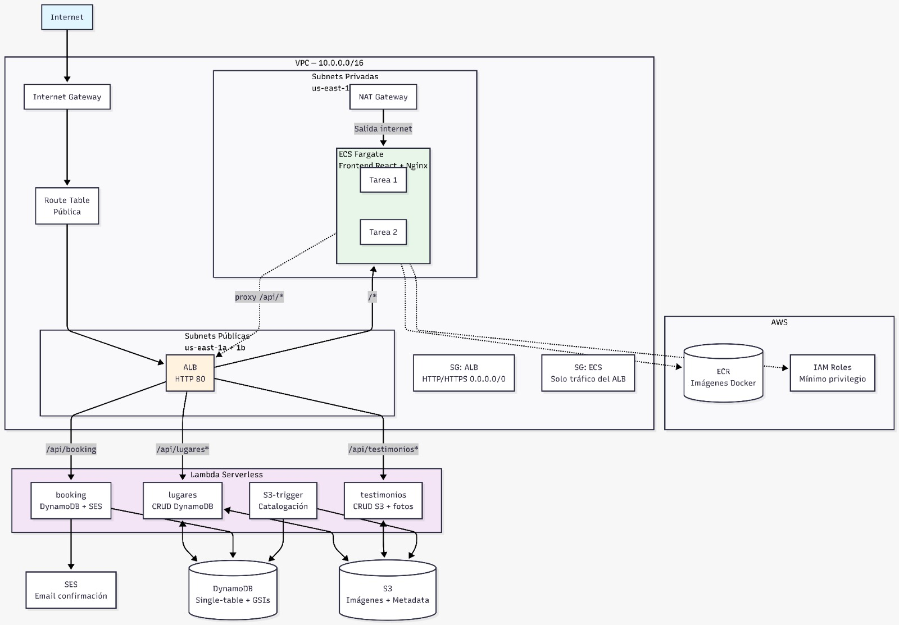
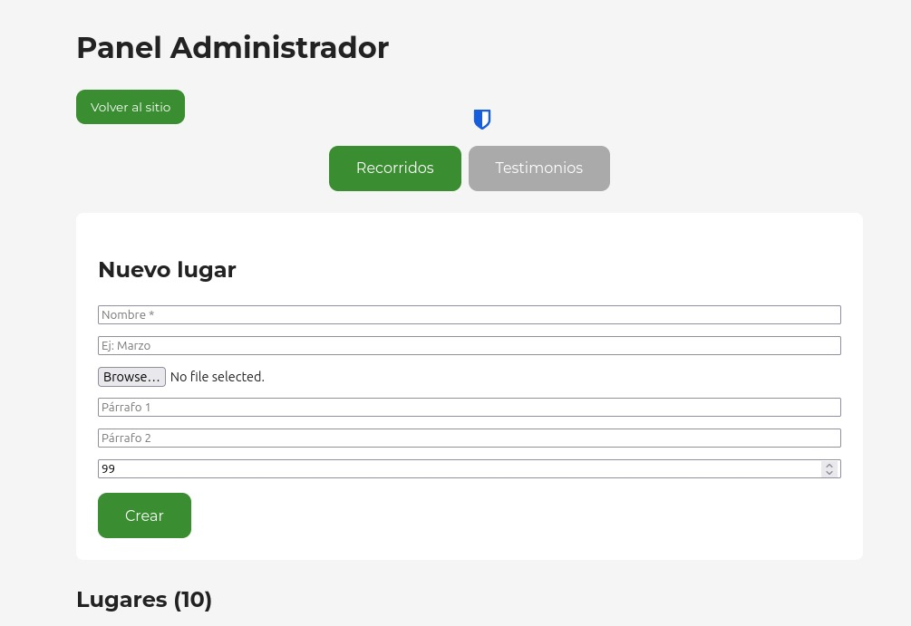
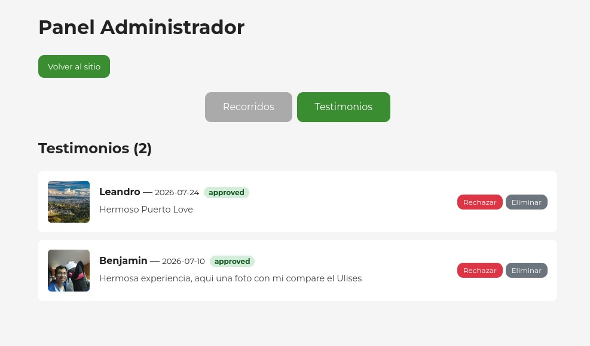
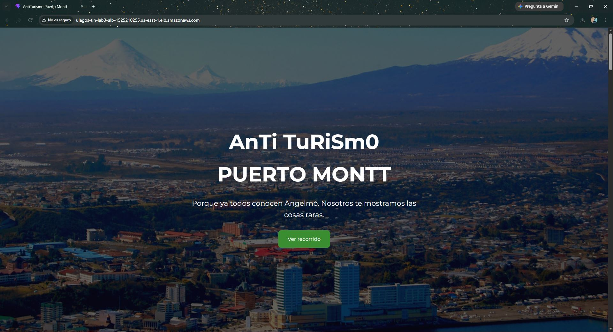
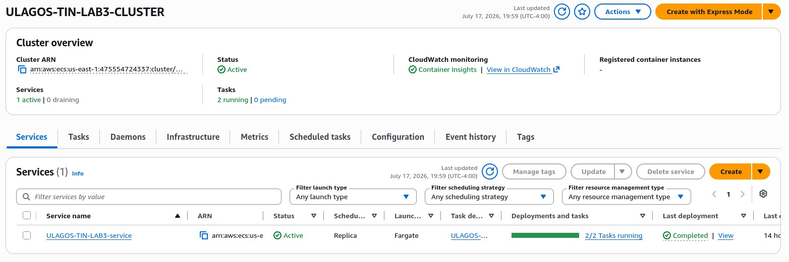
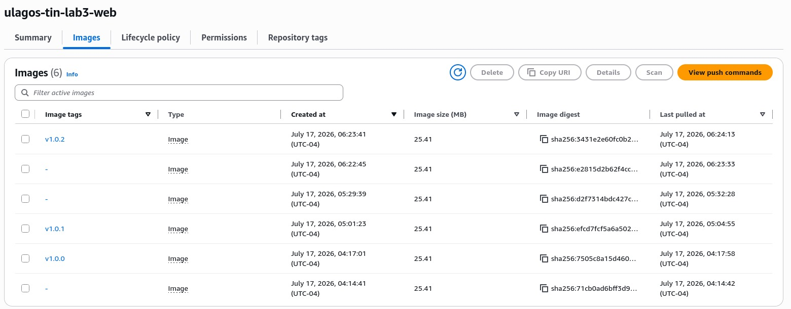
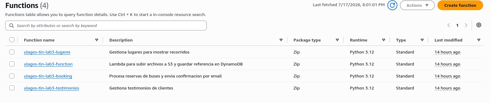

## a) Contexto de negocio

**AntiTurismo Puerto Montt** es una plataforma web que promueve lugares poco convencionales de Puerto Montt, ofreciendo una alternativa al turismo tradicional. La aplicación permite a los visitantes explorar los distintos recorridos disponibles, enviar testimonios con fotografías y reservar cupos para los recorridos.

Además, cuenta con un módulo de administración que permite gestionar los lugares publicados y moderar los testimonios enviados por los usuarios, aprobando o rechazando su publicación.

Los flujos principales son:

1. **Visitante**: explora los recorridos → envía testimonio con fotografías (opcional) → reserva cupo.
2. **Administrador**: crea, edita y elimina lugares del recorrido → aprueba o rechaza testimonios.

La solución se encuentra completamente desplegada en AWS usando Infraestructura como Código (IaC) mediante Terraform. El frontend se ejecuta en contenedores administrados por Amazon ECS Fargate, mientras que el backend se implementa mediante funciones serverless con AWS Lambda.

\newpage

## b) Diagrama de infraestructura



## c) Justificación técnica

### Proveedor y versión de Terraform

Se utiliza Terraform con un backend remoto en Amazon `S3` para almacenar el estado de la infraestructura (`terraform.tfstate`) de forma centralizada, segura y accesible para todos los integrantes del equipo. Esto permite trabajar colaborativamente evitando que cada desarrollador mantenga una copia local del estado. Además, el proveedor de AWS se fija en la versión `~> 6.52.0` para garantizar compatibilidad y estabilidad durante los despliegues.

```hcl
terraform {
  required_version = ">= 1.15"
  required_providers {
    aws = {
      source  = "hashicorp/aws"
      version = "~> 6.52.0"
    }
  }
  backend "s3" {
    use_lockfile = true
    encrypt = true
  }
}
```

- **Decisión**: Se selecciona Amazon `S3` como backend remoto debido a que entrega una solución simple y eficiente para compartir el estado de Terraform entre los integrantes del equipo, sin requerir componentes adicionales de infraestructura. Además, permite mantener el estado protegido mediante cifrado y gestionar bloqueos durante las operaciones de Terraform mediante `use_lockfile = true`, evitando ejecuciones simultáneas que puedan generar conflictos. Debido a que Terraform desde la versión 1.10 incorporó este mecanismo nativo de bloqueo, ya no es necesario utilizar `DynamoDB` como servicio adicional para el manejo del lock.

### VPC y Subnets

La red se implementa utilizando el módulo oficial `terraform-aws-modules/vpc/aws ~> 6.6.1`, el cual permite crear una VPC siguiendo buenas prácticas de configuración de red en AWS. Se utiliza el bloque CIDR privado `10.0.0.0/16`, reservado para redes internas, evitando conflictos con rangos públicos o redes externas.

```hcl
module "net_connections" {
  source            = "terraform-aws-modules/vpc/aws"
  version           = "~> 6.6.1"
  name              = "${var.project}-VPC"
  cidr              = "10.0.0.0/16"
  azs               = ["us-east-1a", "us-east-1b"]
  public_subnets    = ["10.0.1.0/24", "10.0.2.0/24"]
  private_subnets   = ["10.0.100.0/24", "10.0.200.0/24"]
  enable_nat_gateway     = true
  single_nat_gateway     = true
  enable_dns_hostnames   = true
  enable_dns_support     = true
}
```

- **CIDR `/16`**: permite disponer de un amplio rango de direcciones IP privadas (más de 65.000), entregando capacidad suficiente para agregar nuevos servicios y recursos en futuras expansiones.
- **Múltiples zonas de disponibilidad (AZs)**: la infraestructura se distribuye entre `us-east-1a` y `us-east-1b`, permitiendo implementar los servicios en más de una zona y mejorar la tolerancia ante fallos de una zona específica.
- **Subnets públicas y privadas**: se crean dos subnets públicas y dos privadas para separar componentes expuestos a internet de aquellos que deben permanecer aislados. Las subnets públicas alojan el Application Load Balancer (ALB), mientras que las subnets privadas contienen las tareas ECS Fargate, evitando exposición directa hacia internet.
- **NAT Gateway único**: se configura un único NAT Gateway para permitir que los recursos en subnets privadas puedan realizar conexiones salientes hacia internet, necesarias para descargar imágenes desde ECR y enviar información a servicios como CloudWatch. Se opta por una única instancia debido a que reduce costos operacionales frente a implementar un NAT Gateway por cada zona de disponibilidad, aceptando una menor redundancia.
- **Soporte DNS habilitado**: las opciones `enable_dns_hostnames` y `enable_dns_support` permiten la resolución de nombres DNS dentro de la VPC, facilitando la comunicación entre servicios de AWS.

### Security Groups

Se definen dos Security Groups aplicando el principio de mínimo privilegio:

**ALB (público)**:

```hcl
module "security_group_alb" {
  ingress_rules = {
    http  = { from_port = 80,  ip_protocol = "tcp", cidr_ipv4 = "0.0.0.0/0" }
    https = { from_port = 443, ip_protocol = "tcp", cidr_ipv4 = "0.0.0.0/0" }
  }
  egress_rules = {
    all = { ip_protocol = "-1", cidr_ipv4 = "0.0.0.0/0" }
  }
}
```

**ECS (privado)**:

```hcl
module "security_group_priv" {
  ingress_rules = {
    from-alb = {
      ip_protocol                  = "-1"
      referenced_security_group_id = module.security_group_alb.id
    }
  }
  egress_rules = {
    all = { ip_protocol = "-1", cidr_ipv4 = "0.0.0.0/0" }
  }
}
```

- **Decisión**: se separan los permisos de red entre el ALB y las tareas ECS para mantener una arquitectura con control de acceso por capas. El Security Group del ALB permite tráfico HTTP desde internet mediante el puerto 80, mientras que el puerto 443 queda habilitado como preparación para incorporar HTTPS mediante certificados TLS en futuras mejoras.

El Security Group privado de ECS restringe las conexiones entrantes permitiendo únicamente tráfico proveniente del Security Group del ALB, en lugar de permitir accesos mediante rangos de IP. Esto evita que las tareas puedan ser alcanzadas directamente desde internet o desde otros recursos no autorizados, obligando a que toda comunicación externa pase primero por el balanceador.

El tráfico de salida (`egress`) se mantiene habilitado para permitir que los contenedores realicen conexiones necesarias para su funcionamiento, como descarga de imágenes desde ECR, envío de logs hacia CloudWatch y comunicación con otros servicios administrados de AWS.

### Application Load Balancer

El ALB funciona como el único punto de entrada público de la aplicación, conectándose a la VPC mediante las subnets públicas. Se configura utilizando el módulo `terraform-aws-modules/alb/aws ~> 10.5.0`:

```hcl
module "alb" {
  name    = "${var.project}-ALB"
  subnets = module.net_connections.public_subnets

  listeners = {
    ex-http = {
      port     = 80
      protocol = "HTTP"

      forward = {
        target_group_key = "web-fargate"
      }

      rules = {
        booking = {
          priority = 10
          conditions = [{
            path_pattern = {
              values = ["/api/booking"]
            }
          }]
        }

        testimonios = {
          priority = 20
          conditions = [{
            path_pattern = {
              values = ["/api/testimonios*"]
            }
          }]
        }

        lugares = {
          priority = 30
          conditions = [{
            path_pattern = {
              values = ["/api/lugares*"]
            }
          }]
        }
      }
    }
  }
}
```

- **4 Target Groups**: web-fargate (tipo IP, utilizado para dirigir tráfico hacia las tareas ECS Fargate), booking-lambda, testimonios-lambda y lugares-lambda (tipo Lambda, utilizados para ejecutar las funciones correspondientes).
- **Path-based routing**: el ALB inspecciona la ruta solicitada por el usuario y redirige la petición al servicio correspondiente:
  - `/api/booking` → Lambda de reservas
  - `/api/testimonios*` → Lambda de testimonios
  - `/api/lugares*` → Lambda de lugares
  - `/*` (ruta por defecto) → ECS Fargate, donde se encuentra la aplicación React.
- **Decisión**: se utiliza un Application Load Balancer como punto central de entrada para la aplicación, permitiendo manejar tanto el acceso al frontend como las solicitudes del backend mediante un único componente. Las reglas del listener permiten realizar enrutamiento basado en rutas, funcionando como una capa de distribución similar a un API Gateway, donde las peticiones hacia `/api/*` son dirigidas automáticamente hacia las funciones Lambda correspondientes.

### ECS Fargate (Frontend)

El frontend corresponde a una aplicación React construida con Vite y desplegada como un contenedor Docker dentro de Amazon ECS utilizando el modo de ejecución Fargate. El despliegue utiliza el módulo `terraform-aws-modules/ecs/aws ~> 7.5.0`:

```hcl
module "ecs" {
  cluster_name = "${var.project}-CLUSTER"
  services = {
    web = {
      cpu          = 256
      memory       = 512
      desired_count = 2
      launch_type   = "FARGATE"
      subnet_ids         = module.net_connections.private_subnets
      assign_public_ip   = false
      container_definitions = {
        web = {
          image = "${data.aws_ecr_repository.web.repository_url}:${var.ecr_image_tag}"
          portMappings = [{ containerPort = 80 }]
        }
      }
    }
  }
}
```

- **Decisión Fargate vs EC2**: se utiliza Fargate debido a que elimina la necesidad de administrar servidores directamente, evitando tareas como mantenimiento del sistema operativo, instalación de Docker y gestión de capacidad. Para una aplicación con bajo tráfico esperado y un equipo reducido, esta alternativa simplifica la operación y mantenimiento de la infraestructura.
- **256 CPU / 512 MB**: se utiliza una configuración de `0.25 vCPU` y `512 MB` de memoria, correspondiente al mínimo requerido para ejecutar una tarea Fargate. Debido a que el frontend únicamente sirve contenido estático de React, esta cantidad de recursos es suficiente para la carga esperada.
- **2 tareas en ejecución (`desired_count = 2`)**: permite mantener dos instancias del frontend distribuidas dentro de la infraestructura disponible. En caso de que una tarea falle, el Application Load Balancer puede redirigir las solicitudes hacia la tarea restante, mejorando la disponibilidad del servicio.
- **`launch_type = "FARGATE"`**: permite ejecutar los contenedores mediante una modalidad serverless, donde AWS administra la infraestructura necesaria para ejecutar las tareas sin que el equipo deba gestionar máquinas EC2.
- **Subnets privadas**: las tareas ECS se despliegan dentro de las subnets privadas de la VPC para evitar exposición directa hacia internet. El acceso externo se realiza únicamente mediante el Application Load Balancer, ubicado en las subnets públicas, manteniendo los contenedores aislados y accesibles solo mediante la red interna de AWS.
- **`assign_public_ip = false`**: evita que las tareas ECS reciban direcciones IP públicas, reforzando la seguridad al impedir conexiones directas desde internet hacia los contenedores.
- **Imagen del contenedor**: la imagen Docker se obtiene dinámicamente desde Amazon ECR mediante el repositorio configurado en Terraform. La etiqueta (`tag`) se obtiene desde las variables definidas en `tfvars`, permitiendo seleccionar la versión específica de la aplicación que será desplegada.
- **`portMappings`**: define el puerto mediante el cual ECS comunica el contenedor con el balanceador de carga. Se utiliza el puerto `80` debido a que es el puerto donde el servidor web del contenedor expone la aplicación frontend.

### Lambda (Backend serverless)

Se implementan `3` funciones Lambda en `Python 3.12` utilizando el módulo `terraform-aws-modules/lambda/aws ~> 8.8.0`. Cada función cuenta con permisos `IAM` acotados, siguiendo el principio de mínimo privilegio y permitiendo únicamente el acceso a los recursos necesarios para su funcionamiento.

**Lambda de lugares** (`/api/lugares*`):

```python
def handler(event, context):
    method = event.get("httpMethod", "GET")
    path = event.get("path", "/api/lugares")
    if method == "GET" and path == "/api/lugares":
        return list_all()
    if method == "POST" and path == "/api/lugares":
        return create(json.loads(event.get("body", "{}")))
    if method == "PUT" and path.startswith("/api/lugares/"):
        return update(lugar_id, json.loads(event.get("body", "{}")))
    if method == "DELETE" and path.startswith("/api/lugares/"):
        return delete(lugar_id)
```

- Implementa operaciones CRUD sobre los lugares turísticos.
- Los registros se almacenan en `DynamoDB`, mientras que las imágenes asociadas se almacenan en `S3`.
- Al consultar lugares mediante GET, la Lambda genera URLs prefirmadas de `S3` con una expiración de 1 hora, evitando que el bucket de imágenes deba ser público.
- Se usa `Scan` con `FilterExpression` por `entity_type = "lugar"` para obtener únicamente los registros correspondientes a lugares dentro de la tabla compartida.

**Lambda de testimonios** (`/api/testimonios*`):

- Almacena los metadatos de los testimonios como archivos `JSON` en `testimonios-meta/{uuid}.json` y las imágenes asociadas en `testimonios/{uuid}.jpg` dentro del bucket `S3`.
- El endpoint `GET` público retorna únicamente testimonios con estado `approved`, ordenados por fecha.
- El endpoint `GET` administrativo permite consultar todos los testimonios para procesos de moderación.
- El método `POST` crea nuevos testimonios con estado inicial `pending`.
- El método `PUT` permite modificar el estado del testimonio, aprobándolo (`approved`) o rechazándolo (`rejected`).
- El método `DELETE` elimina tanto la imagen asociada como los metadatos almacenados en `S3`.

**Lambda de reservas** (`/api/booking`):

```python
# Guarda en DynamoDB y envía email via SES
item = {
    "id": str(uuid.uuid4()),
    "nombre": body["nombre"],
    "user-mail": body["email"],
    "tramo": body["tramo"],
    "fecha": body["fecha"],
    "created_at": datetime.now(timezone.utc).isoformat(),
}
table.put_item(Item=item)
ses.send_email(
    Source=os.environ["SENDER_EMAIL"],
    Destination={"ToAddresses": [body["email"]]},
    Message={...}
)
```

- Recibe `POST` con `nombre`, `email`, `tramo`, `fecha`. Almacena en `DynamoDB` y envía confirmacion por email via SES.
- Tiene una `Function URL` pública como respaldo (sin autenticación, `CORS` abierto).

**Lambda de catálogo S3** (trigger: `s3:ObjectCreated:*`):

- Recibe solicitudes de reserva mediante los datos `nombre`, `email`, `tramo` y `fecha`.
- Guarda la información de la reserva en `DynamoDB`.
- Envía un correo de confirmación al usuario mediante Amazon SES.
- Posee una `Function URL` pública como respaldo, configurada sin autenticación y con `CORS` abierto.

### DynamoDB

Se usa una única tabla compartida para todas las entidades, diferenciadas por el atributo `entity_type`:

```hcl
module "dynamodb-table" {
  name     = "ulagos-tin-lab3"
  hash_key = "id"
  attributes = [
    { name = "id",          type = "S" },
    { name = "entity_type", type = "S" },
    { name = "recorrido",   type = "S" },
    { name = "user-mail",   type = "S" },
    { name = "tramo",       type = "S" },
    { name = "fecha",       type = "S" },
  ]
  global_secondary_indexes = [
    { name = "entity_type-index", hash_key = "entity_type" },
    { name = "user-mail-index",   hash_key = "user-mail" },
    { name = "tramo-index",       hash_key = "tramo" },
    { name = "fecha-index",       hash_key = "fecha" },
    { name = "recorrido-index",   hash_key = "recorrido" },
  ]
  server_side_encryption_enabled = true
}
```

- **Decisión `single-table` vs `multi-table`**: una sola tabla con `entity_type` como discriminador simplifica la gestión (un solo recurso `Terraform`, un solo `ARN` en las políticas `IAM`) y reduce costos. Los `GSI` permiten consultar por dimensiones específicas (ej. filtrar lugares por `recorrido`, buscar reservas por `user-mail`).
- **Cifrado**: habilitado con `KMS` administrado por AWS sin costo adicional.
- **On-demand**: no se configura capacidad provisionada, ideal para carga baja y esporádica (tráfico de un sitio universitario).

### S3

Bucket único `ulagos-tin-lab3-bucket-us-east-1` para todas las imágenes y metadatos:

```hcl
module "s3-bucket" {
  source  = "terraform-aws-modules/s3-bucket/aws"
  version = "~> 5.14.1"
  bucket  = "${lower(var.project)}-bucket-${var.region}"
}
```

- **Cifrado `SSE-S3` (`AES256`)** activado por defecto.
- **URLs prefirmadas**: en vez de hacer el bucket público, las Lambdas generan URLs temporales de 1 hora con `generate_presigned_url()`. Esto mantiene los datos privados pero accesibles desde el frontend.
- **Estructura de carpetas**: `lugares/{uuid}.jpg`, `testimonios/{uuid}.jpg`, `testimonios-meta/{uuid}.json`.

### SES

```hcl
module "ses" {
  source      = "cloudposse/ses/aws"
  domain      = "benhub.cl"
  verify_dkim = false
}
```

- Envía confirmaciones de reserva desde `antiturismo@benhub.cl`.
- El dominio `benhub.cl` está verificado en Amazon SES mediante registros DKIM configurados manualmente en Cloudflare de forma externa.
- **Decisión SES vs SNS**: se utiliza Amazon SES debido a que es el servicio administrado de AWS diseñado para envío de correos electrónicos transaccionales. Para el volumen esperado de la aplicación (pocas reservas diarias), su costo es reducido y resulta suficiente para enviar confirmaciones sin necesidad de incorporar servicios adicionales.

### IAM

**Rol de ejecucion ECS**: ECS utiliza un rol de ejecución (`execution role`) que permite a las tareas Fargate interactuar con otros servicios de AWS necesarios durante su ejecución. Este rol utiliza una política `IAM` acotada a las operaciones requeridas:

```hcl
module "iam_policy" {
  policy = jsonencode({
    Version = "2012-10-17"

    Statement = [{
      Effect = "Allow"

      Action = [
        "ecr:GetAuthorizationToken",
        "ecr:BatchCheckLayerAvailability",
        "ecr:GetDownloadUrlForLayer",
        "ecr:BatchGetImage",
        "logs:CreateLogStream",
        "logs:PutLogEvents"
      ]

      Resource = "*"
    }]
  })
}
```

La política permite:
- `ecr:GetAuthorizationToken`, `ecr:BatchCheckLayerAvailability`, `ecr:GetDownloadUrlForLayer` y `ecr:BatchGetImage`: obtener autorización y descargar las imágenes de los contenedores desde Amazon ECR.
- `logs:CreateLogStream` y `logs:PutLogEvents`: crear streams y enviar logs de ejecución hacia Amazon CloudWatch.

**Roles Lambda**: cada función cuenta con permisos específicos según sus necesidades operativas:

| Lambda | Permisos |
|--------|----------|
| lugares | `dynamodb:PutItem/GetItem/UpdateItem/DeleteItem/Scan` sobre la tabla correspondiente, además de `s3:PutObject/GetObject` para imágenes |
| testimonios | `s3:PutObject/GetObject/ListBucket/DeleteObject` sobre el bucket de almacenamiento |
| booking | `dynamodb:PutItem` para guardar reservas y `ses:SendEmail/SendRawEmail` para envío de correos |
| S3-trigger | `dynamodb:PutItem/GetItem/Query` y permisos de lectura/escritura en `S3` |

- **Decisión**: se aplica el principio de mínimo privilegio, otorgando a cada servicio únicamente los permisos necesarios para realizar sus funciones. Esto reduce la superficie de ataque y evita accesos innecesarios a recursos de AWS. Las políticas con recursos amplios (*) se mantienen únicamente en casos donde el recurso específico no puede definirse de forma estática, como el envío de correos mediante SES con identidades verificadas dinámicas.

### ECR

```hcl
data "aws_ecr_repository" "web" {
  name = "${lower(var.project)}-web"
}
```

- El repositorio ECR se creó manualmente fuera de Terraform (**`data source`**, no `resource`). Esto evita que un `terraform destroy` accidental elimine todas las imágenes Docker.
- Las imágenes siguen versionado semantico: `v1.0.0`, `v1.0.1`, `v1.0.2`.
- El tag de imagen activo se controla desde `terraform.tfvars` con `ecr_image_tag`.

### CI/CD (`docker_build.sh`)

Script de bash que automatiza el build y despliegue:

```bash
ALB_URL=$(terraform output -raw alb_dns)
APP_TAG=$(grep -oP 'ecr_image_tag\s*=\s*"\K[^"]+' terraform.tfvars)

docker build --no-cache -t $APP:$APP_TAG \
  --build-arg ALB_URL="$ALB_URL" \
  ../sitio-web-2/

docker push $ECR_URI:$APP_TAG
aws ecs update-service --cluster $CLUSTER --service $SERVICE --force-new-deployment
```

1. Lee el DNS del ALB desde `terraform output` (siempre actualizado).
2. Lee el tag de imagen desde `terraform.tfvars` (única fuente de verdad).
3. Construye la imagen Docker con `--no-cache` para garantizar build fresco.
4. Prueba localmente con `docker run` + `curl` (smoke test).
5. Pushea a ECR y fuerza redeploy en ECS.
6. Luego `terraform apply` actualiza la task definition para apuntar al nuevo tag.

## d) Analisis de costos

### Estimacion mensual

| Recurso | Configuracion | Costo unitario | Cantidad | Costo mensual (USD) |
|---------|--------------|----------------|----------|---------------------|
| ECS Fargate (tareas) | 256 CPU + 512 MB RAM | CPU: $0.04048/h, RAM: $0.00445/GB/h | 2 tareas × 730h | ~$17.6 |
| ALB | 1 balanceador activo | $0.0225/hora | 1 × 730h | $16.2 |
| ALB LCU | Tráfico bajo estimado | $0.008/LCU-hora | ~1 LCU | ~$5.8 |
| NAT Gateway | 1 NAT | $0.045/hora | 1 × 730h | ~$32.4 |
| Lambda | 4 funciones | $0.20/1M req + Free Tier | < 1M req/mes | ~$0 |
| DynamoDB | On-demand | $1.25/1M WRU + $0.25/1M RRU | Carga baja | ~$0 |
| S3 | ~1 GB almacenado | $0.023/GB/mes | 1 GB | ~$0.02 |
| CloudWatch Logs | ~5 GB logs | $0.50/GB ingesta | 5 GB | $2.5 |
| ECR | ~500 MB imágenes | $0.10/GB/mes | 0.5 GB | $0.05 |
| **Total estimado** | | | | **~$75/mes** |

### Comparacion con alternativa: EC2

| Enfoque | Costo mensual | Mantenimiento | Escalabilidad |
|---------|--------------|---------------|---------------|
| **Fargate (actual)** | ~$58/mes | Ninguno (AWS gestiona) | Automática (auto-scaling) |
| **EC2 t3.micro × 2** | ~$30/mes (instancias) + $16 ALB = $46 | SO, parches, Docker, seguridad | Manual (agregar instancias) |

**Análisis**: Fargate cuesta aproximadamente $12/mes más que EC2 en este escenario, pero elimina completamente la carga operativa: no hay que mantener servidores Linux, actualizar paquetes de seguridad, ni monitorear capacidad. Para un equipo de 2 personas y un proyecto académico, el ahorro en tiempo de operación justifica ampliamente la diferencia de costo.

### Oportunidades de optimización

- **NAT Gateway**: es el componente con mayor costo de la infraestructura (~$32/mes). Una alternativa para reducir este costo sería utilizar VPC Endpoints para servicios como Amazon ECR, `S3` y `CloudWatch Logs`, disminuyendo la dependencia del NAT Gateway sin exponer las tareas ECS a Internet.
- **Escalar a 1 tarea**: fuera de horarios de mayor utilización, `desired_count = 1` reduce aproximadamente a la mitad el costo asociado a ECS Fargate (de ~$18/mes a ~$9/mes), aunque disminuye la disponibilidad ante fallos.
- **`DynamoDB` provisioned**: el modo **On-Demand** resulta la opción más conveniente para la carga esperada del proyecto, ya que evita pagar capacidad provisionada cuando el volumen de lecturas y escrituras es bajo.
- **Lambda**: el Free Tier de AWS incluye 1 millón de invocaciones gratuitas al mes, por lo que, considerando el bajo volumen esperado de solicitudes, el costo del backend serverless será prácticamente nulo.

\newpage

## e) Capturas

### Panel Administrador



El panel permite crear, editar y eliminar lugares con imágenes. Cada lugar pertenece a un recorrido (ej: "Pasado", "Marzo") y tiene orden de aparición.

\newpage
### Moderacion de Testimonios



El administrador puede aprobar, rechazar o eliminar testimonios enviados por usuarios. Solo los aprobados aparecen en el carrusel público.

\newpage
### Sitio web público



La landing page muestra el hero, lugares filtrados por recorrido, carrusel de testimonios aprobados, y formulario de reserva.

\newpage
### ECS corriendo



El servicio ECS mantiene 2 tareas en ejecución sobre 2 zonas de disponibilidad. El ALB distribuye tráfico entre ambas.

\newpage
### Repositorio ECR



Las imágenes Docker se versionan con tags semanticos (`v1.0.0`, `v1.0.1`, `v1.0.2`). Cada nuevo despliegue genera una imagen inmutable.

\newpage
### Funciones Lambda



Las 4 funciones Lambda procesan APIs REST sin servidores. Cada una tiene políticas `IAM` acotadas a los recursos mínimos necesarios.

\newpage
## f) Conclusiones

La arquitectura implementada combina contenedores (ECS Fargate) para el frontend y funciones serverless (Lambda) para el backend, logrando un sistema **end-to-end funcional, con una arquitectura diseñada para escalar y siguiendo buenas prácticas de seguridad**. Toda la solución se encuentra desplegada sobre AWS.

**Fortalezas de la solución**:

1. **Infraestructura como Código**: cada recurso AWS está definido en Terraform, permitiendo recrear el entorno completo en minutos con `terraform apply`. El estado remoto en `S3` permite colaboración entre desarrolladores.

2. **Alta disponibilidad**: La infraestructura distribuye el ALB y las tareas ECS entre dos zonas de disponibilidad, mejorando la tolerancia a fallos. `DynamoDB`, al ser un servicio administrado de AWS, proporciona alta disponibilidad de forma nativa.

3. **Seguridad por capas**: los recursos de cómputo (ECS, Lambda) no estan expuestos directamente a internet. Solo el ALB tiene acceso público, y las tareas ECS corren en subnets privadas sin IP pública.

4. **Serverless donde aplica**: las APIs usan Lambda (pago por uso, escala a cero), mientras que el frontend usa contenedores (adecuado para desplegar la aplicación React mediante un contenedor web). Esta combinación optimiza costos para la carga esperada.

5. **Mínimo privilegio `IAM`**: cada función Lambda y el rol de ejecución de ECS cuentan únicamente con los permisos necesarios para realizar sus funciones, aplicando el principio de mínimo privilegio y reduciendo la superficie de ataque.

**Mejoras futuras**:

- Agregar HTTPS mediante certificado `ACM` y listener en puerto 443.
- Migrar autenticación del panel admin al backend (`JWT` o `API Key` en Lambda) para eliminar la validación client-side.
- Implementar CI/CD con `GitHub Actions` para construir y desplegar automáticamente al hacer push a `main`.
- Agregar `CloudFront` como CDN para los assets estáticos, reduciendo latencia y carga al ALB.
- Activar auto-scaling de ECS (`enable_autoscaling = true`) para manejar picos de tráfico.
- Implementar VPC Endpoints para ECR, `S3` y `CloudWatch Logs`, reduciendo la dependencia del NAT Gateway y disminuyendo costos operacionales.
